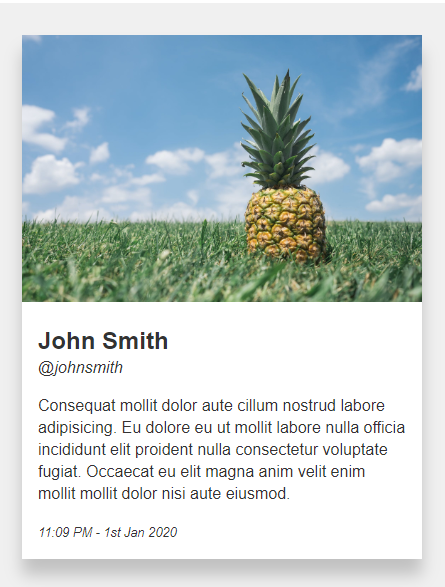

# BEM Card

This excersise is practices marking up the elements of a block/component.

## Task 1

Style the HTML in `index.html` to match the image.

### Additional styling
- Be sure the card, and all elements within it, fill the available space i.e.  Do **not** set widths on this component, or any components you create.

### Steps

1. The initial "card" class has been added for the compontent a button class to each of the HTML clickable elements.
1. Add a class to every element, even if class is not initially used in the CSS.
1. in `main.css`, style the compontent to make all the HTML match the image.

# Answer

Once completed, checkout the `answer` branch to **compare your answer** to the working code.